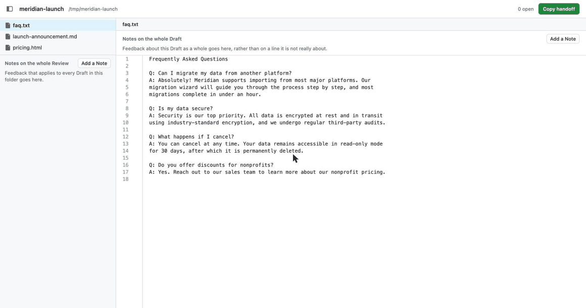

<div align="center">

# galley

**Review AI-generated prose like a pull request.**

[](./LICENSE)
[](https://nodejs.org)
[](#contributing)



<sub>A Note left on a fabricated statistic, answered by an agent, then Resolved. The agent's half is a script writing to <code>.feedback/notes.json</code> — that file is the entire interface, so any agent that can read a file can do the same.</sub>

</div>

---

galley is a local editor for reviewing AI-generated prose and markup. Point it at a
folder of `.md`, `.html`, and `.txt` files and review them the way you'd review a
pull request — line numbers, select a range, leave a note. Your notes are written to
a JSON sidecar in the folder, so any coding agent can read them, revise the files,
and reply.

```bash
npx github:phuocphn/galley ./out
```

It starts a local server, opens your browser, and reads the files already on your
disk. Nothing is uploaded and there is no account.

## Why

AI writes faster than anyone can check it, and generation has no natural stopping
point — a model will revise forever, and nothing in the loop ever says *done*. What
is missing is not more generation but verification: somewhere to record what is
wrong, hand it back, and see what actually changed. galley borrows the one review
interface everybody already knows, the GitHub pull request, and points it at prose.
Select a range, leave a Note, hand it to your agent. Those Notes are the exit
condition — the work is finished when the list is empty, and the agent cannot empty
it. It can reply, and it can mark a Note Answered; only you can mark it Resolved.

## Key features

**Review a folder like a pull request.** Every Draft — one AI-generated file under
review — sits in a sidebar with line numbers. Select any range and leave a Note in
the margin. The Draft pane is a real editor too, so when explaining the fix is
slower than making it, just make it; edits autosave and the agent is told the
current text is intentional.

**Notes survive the rewrite.** A Note anchors to *text*, not a line number, storing
enough surrounding context to be re-found after the agent has rewritten the passage.
When the passage is genuinely gone, the Note becomes Orphaned and is pinned to the
top of the Draft for re-attachment — never silently dropped, and never silently
pointing at the wrong line.

**Three Scopes.** A Note can reach a passage, a whole Draft, or the whole Review —
the folder you opened. Feedback that applies to everything doesn't have to be pasted
onto everything.

**Three Kinds.** A Note is a Fix, a Question, or an Idea, and the Kind changes what
the agent does with it. A Question wants an answer in a Reply and no edit at all; an
Idea is a suggestion the agent may decline, as long as it says why.

**A plain JSON sidecar is the whole contract.** Everything lands in
`.feedback/notes.json`, documented by a `README.md` generated beside it. Any agent
that can read a file can act on it — nothing is coupled to a particular CLI. Commit
the folder and the Note → Reply → Resolve trail lives in git next to the prose,
instead of evaporating in a chat window.

**Replies, and an exit condition you hold.** The agent writes a Reply under each
Note saying what it changed or why it didn't, which moves the Note to Answered. Only
you can move it to Resolved. Reply again and it reopens.

## The handoff

galley never launches an agent. Click **Copy handoff** and paste the result into
whichever one you use — it is a self-contained instruction that says where the
sidecar is, what is outstanding, how to locate each Note by its anchored text, and
how to reply. The agent edits the Drafts and writes back into the same file, merging
by Note `id`; galley watches the folder and pulls the changes into the open editor.

```json
{
  "id": "b4f94f90-b574-4cf4-92f8-65cac24f30f0",
  "draftPath": "launch-announcement.md",
  "anchor": { "text": "Meridian 2.0 delivers a 40% improvement in query performance across the board.", "before": "…", "after": "…" },
  "body": "We have no benchmark for this. Cut the 40% claim or replace it with something we can actually cite.",
  "kind": "fix",
  "status": "open",
  "replies": []
}
```

## Try it

The repo ships a folder of deliberately over-cooked AI marketing copy to practise on:

```bash
git clone https://github.com/phuocphn/galley
cd galley
npm install
npm start -- ./examples
```

## Contributing

Contributions are welcome, and **issues are the front door**. Open one before
sending a patch — for a bug, a use case that doesn't fit, or a place where the tool
is wrong about its own domain. Once an issue exists and the shape of the fix is
agreed, a pull request is very welcome.

Read [`CONTEXT.md`](./CONTEXT.md) first. It defines the words this project uses —
Draft, Note, Anchor, Scope, Kind, Reply, Status, Review — and which words to avoid.
Code, UI copy, and issues all use them, and a patch that calls a Note a "comment"
costs more to unpick than it saves. The decisions behind the design, and the options
that lost, are in [`docs/adr/`](./docs/adr).

## Development

```bash
npm install
npm test          # Vitest against the Review API, over temp fixture folders
npm run typecheck
npm run build     # client (Vite) + server (tsc) into dist/
node dist/cli.js ./some-folder
```

`npm run dev` serves the client with hot reload and proxies `/api` to a server
started separately with `npm run dev:server -- ./some-folder`.

## License

MIT — see [`LICENSE`](./LICENSE).
